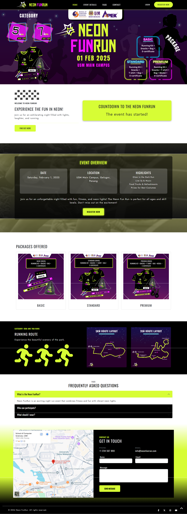
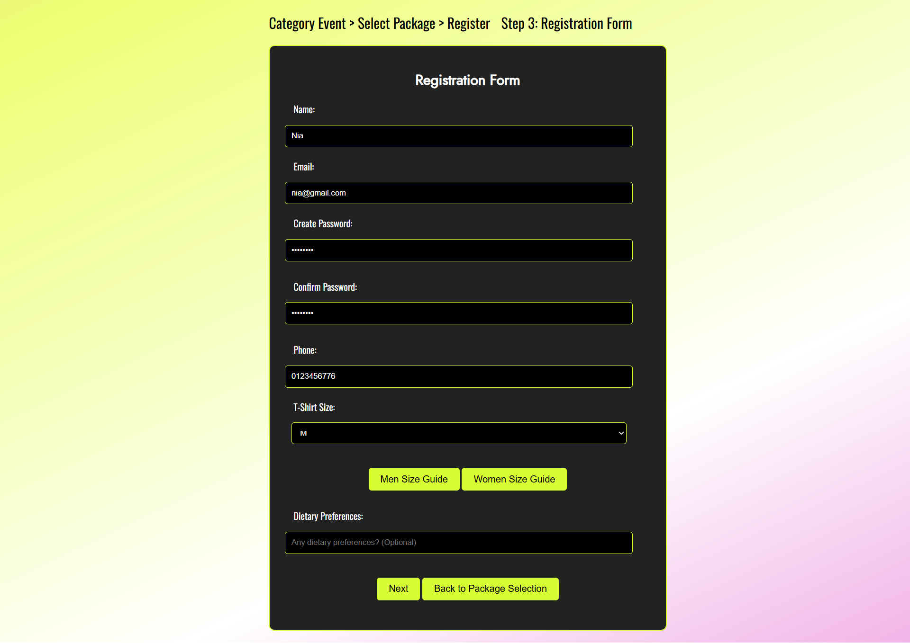
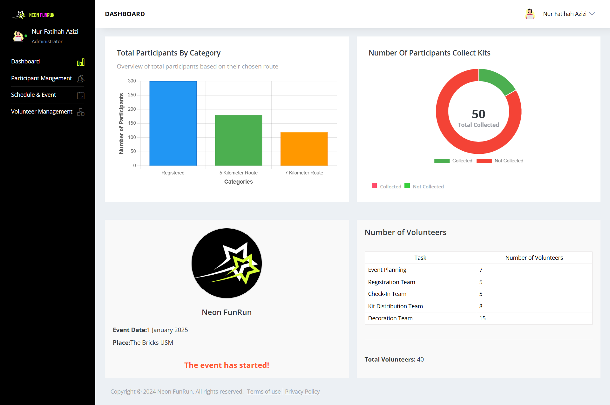
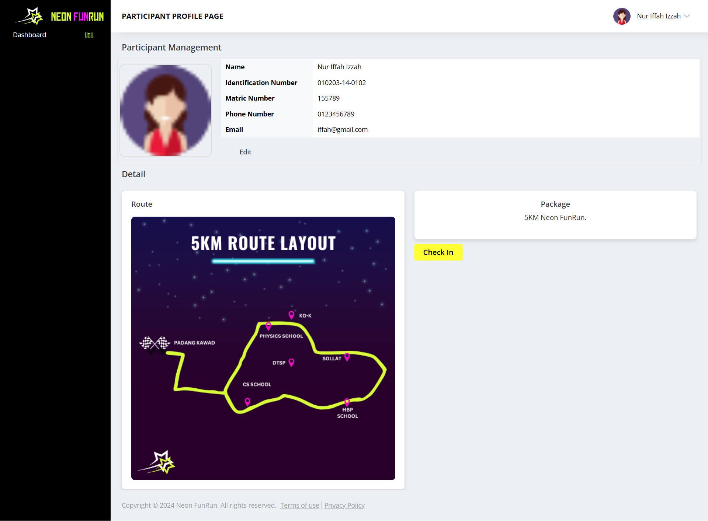

# 🎉 Neon FunRun – Event Management System

## 📌 Overview

Neon FunRun is a web-based event management system developed to streamline the organization of fun run events. It provides a centralized platform for participants, administrators, and organizers to manage event registration, user data, and event operations efficiently.

---

## 🚀 Features

* User authentication (Admin & Participant)
* Event registration with category & package selection
* Participant profile with QR code check-in
* Admin dashboard for managing events and users
* Event information module (details, countdown, FAQ)
* Inquiry submission system

---

## 🛠️ Tech Stack

* **Frontend:** HTML, CSS, JavaScript, Bootstrap
* **Backend:** Laravel 
* **Database:** MySQL / JSON

---

## 📂 Project Structure

```
neon-funrun/
├── event-info/              # Event details & UI
├── event-registration/      # Registration logic & server
├── admin-dashboard/         # Admin panel
├── profile-management/      # User profile & login
└── index.html               # Main entry point
```

---

## ⚙️ How to Run

### 1. Clone the repository

```
git clone https://github.com/NurulainHamzah/neonfunrun.git
```

### 2. Open frontend

Open `index.html` in browser

### 3. Run backend (if needed)

```
cd event-registration
node server.js
```

---

## 🎯 Purpose

This project was developed as part of a Web Engineering course to demonstrate full-stack development, system design, and event management solutions.

---

## 📸 System Screenshots

### 🏠 Homepage


### 📝 Registration Page


### 📊 Admin Dashboard


### 👤 User Profile Page


---

## 🔗 Live Demo

https://neonfunrun-cmt322.fly.dev

---

